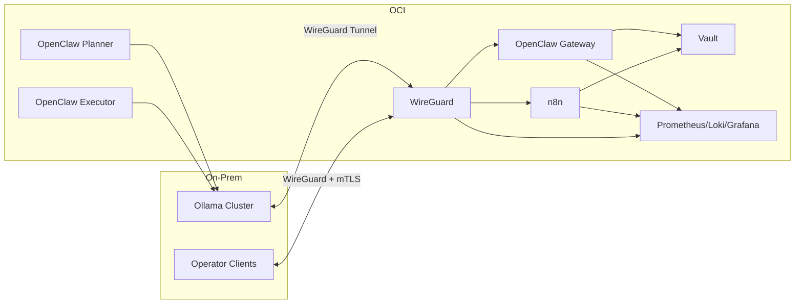

# OpenClaw Architecture Overview

OpenClaw is designed as a secure bridge between an OCI-hosted agent stack and an on-prem compute cluster (Ollama). The system is built on these pillars:

1. **Transport Security** – WireGuard provides a site-to-site tunnel between OCI and on-prem resources. All management and data traffic flows inside this encrypted channel.
2. **Identity & Trust** – A gentoofoo-controlled public key infrastructure (PKI) issues certificates for every server and client. Mutual TLS (mTLS) is enforced for internal APIs and operator access.
3. **Secret Governance** – HashiCorp Vault manages all sensitive material: AppRole credentials, short-lived TLS certificates, encryption keys, and workflow secrets for n8n.
4. **Composable Services** – OpenClaw gateway/planner/executor and n8n run as Docker services with dedicated configs. Each binds only to WireGuard or localhost interfaces.
5. **Observability First** – Prometheus, Loki, Grafana, Vector, node exporter, and cAdvisor deliver metrics, logs, and dashboards out of the box.
6. **Automation & Testing** – Terraform (future) codifies infrastructure; scripts handle bootstrap/deployment; health checks run on a schedule to catch regressions quickly.

## High-Level Flow

## Trust Zones

| Zone | Components | Access Method |
|------|------------|---------------|
| OCI Secure | WireGuard, Vault, OpenClaw services, n8n, observability | Localhost/WireGuard only |
| On-Prem Secure | Ollama cluster, operator devices | WireGuard peers + gentoofoo CA |
| Public Internet | OCI VM management IP | SSH (keys), optional future HTTPS |

## Key Decisions

- **No public reverse proxy by default.** All services are reachable only through WireGuard plus mTLS. Traefik or other proxies can be layered later if external HTTPS is required.
- **PKI rooted in gentoofoo.com.** The repo ships scripts to generate the hierarchy but never stores private material; you control issuance and rotation.
- **Vault-first secrets.** Services should read credentials from Vault at runtime rather than environment variables. Example policies and AppRole definitions are included.
- **Observability is non-optional.** The observability stack is treated as a first-class citizen to provide telemetry during every stage of deployment.

## Component Checklist

| Component | Responsibility | Notes |
|-----------|----------------|-------|
| WireGuard | Encrypted transport between OCI and on-prem | Server listens on UDP 51820; peers defined per site/device |
| Vault | PKI issuance, secret storage | Dockerized single node initially; plan for HA later |
| OpenClaw (gateway/planner/executor) | Agent control plane and workers | Configured via TOML files in `platform/configs/openclaw/` |
| n8n | Workflow engine for automation | Uses Vault for credentials; accessible via WireGuard only |
| Observability stack | Metrics/logs dashboards | Prometheus scrapes services, Loki ingests logs via Vector |
| Terraform (future) | OCI/DNS automation | Scaffolding ready under `infra/terraform/` |

Refer to `/docs/setup/*` for step-by-step instructions on provisioning OCI, WireGuard, Vault, and the Docker stacks.
